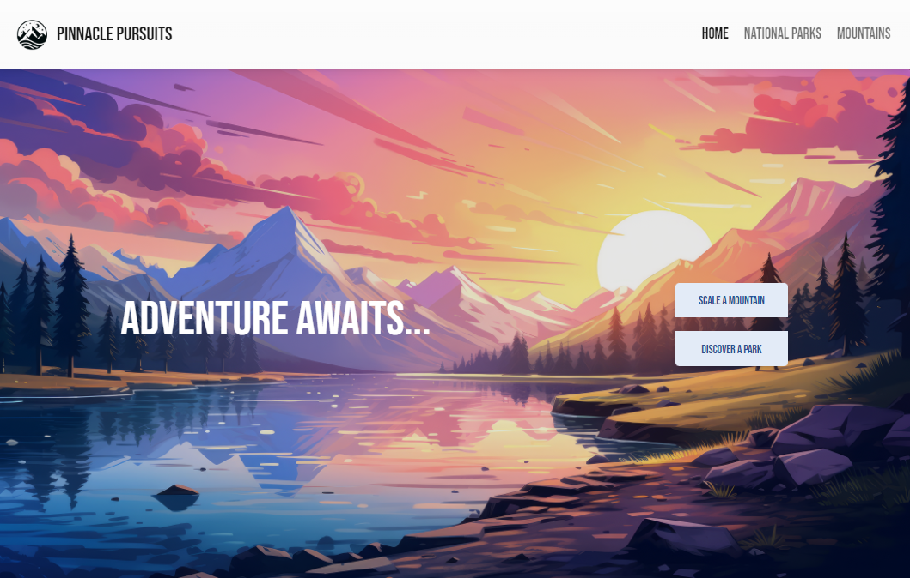
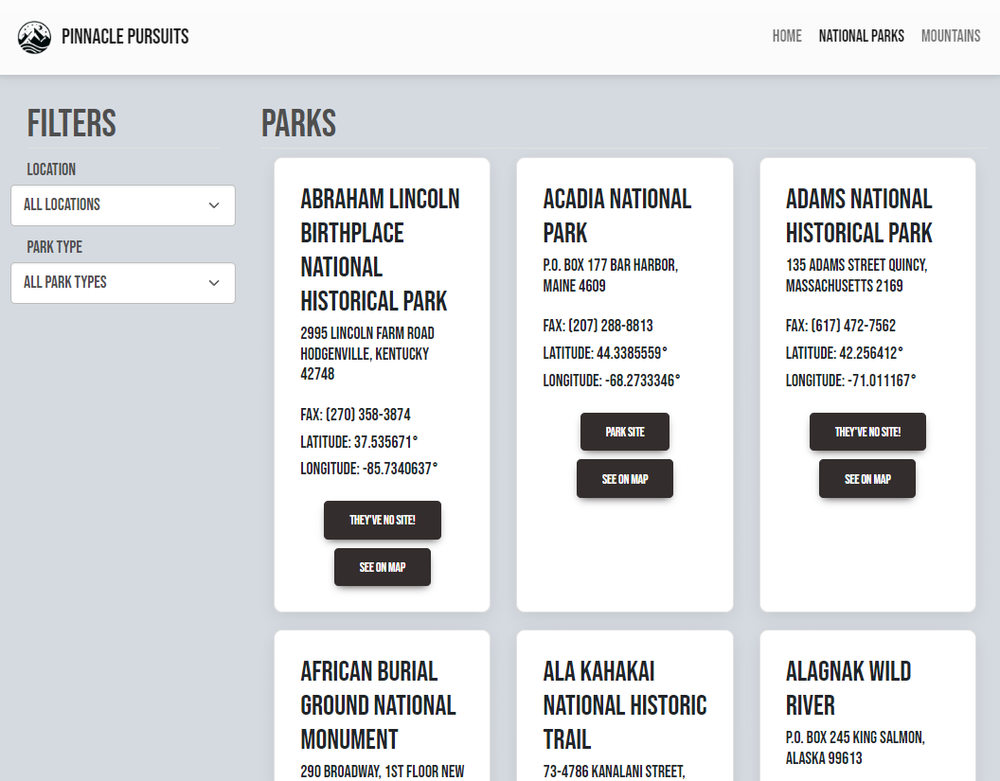
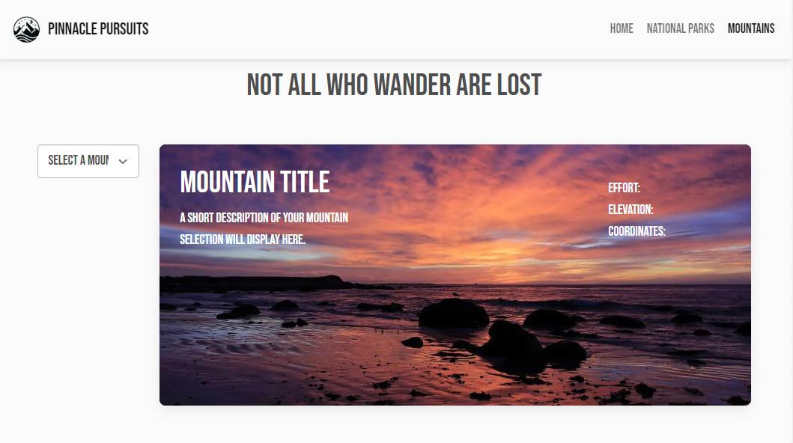

# Project Description
---

In this capstone project, I’ll be building an informational website for users to teach their adventurous selves all about the great outdoors! Our most inspirational AI generated mission statement: Pinnacle Pursuits seeks to empower exploration and foster a deep connection with nature. We are dedicated to curating and delivering invaluable insights, tips, and inspiration for outdoor enthusiasts. We strive to be the ultimate companion on your journey to the great outdoors, enhancing your adventures with knowledge that enlightens, excites, and enriches your outdoor experience.

---

## [Site Live Link](https://mu9seb.github.io/PinnaclePursuits/)
---

# Excellency Goals
---

- Consistent look and feel throughout the site with functional navigation
    - Uniform header, navbar, and footer
- Responsive User Interface
- Public code repo with an appropriate branching strategy, and meaningful commit history
- Best Practices
    - Proper directory structure
    - Standard naming conventions
    - Well-formatted code
        - Effective commenting
    - No JS errors at run time (constant Console inspection)

# Project Criteria
---

- [x]  Homepage
    - Highlights the Organization
    - Provides easy navigation to rest of the site
- [x]  National Parks Search Page
    - Provides UI for user to find their perfect park
    - Basic Requirements
        - Search Filters
            - [x]  Location
            - [x]  Park type
    - Stretch Goals
        - [x]  Provide a **View All National Parks** option
        - [x]  Display URL alongside park info for user to visit, ensure URLs open in new tabs
- Mountains Information Page
    - Provides UI for users to explore the minutiae of 48 different mountains
    - Basic Requirements
        - [x]  Dropdown list of all 48 mountains
            - [x]  Upon selection, page will display name, description, elevation, etc.
    - Stretch Goals
        - [x]  Use bootstraps card to display images along with mountain information
        - [ ]  Display daily sunrise and sunset times as well as other mountain data
            
            ```jsx
            // function that can "fetch" the sunrise/sunset times
            async function getSunsetForMountain(lat, lng){
            let response = await fetch(
            `https://api.sunrise-sunset.org/json?lat=${lat}&lng=${lng}&date=today`);
            let data = await response.json();
            return data;
            }
            
            // Fetch the sunset/sunrise times for a specific mountain
            getSunsetForMountain(44.320686, -71.291742).then(data => {
            console.log(data.results)
            });
            ```
            
            ---
            

# Site Preview
---

### Home Page



## National Parks Page



## Mountains Page


